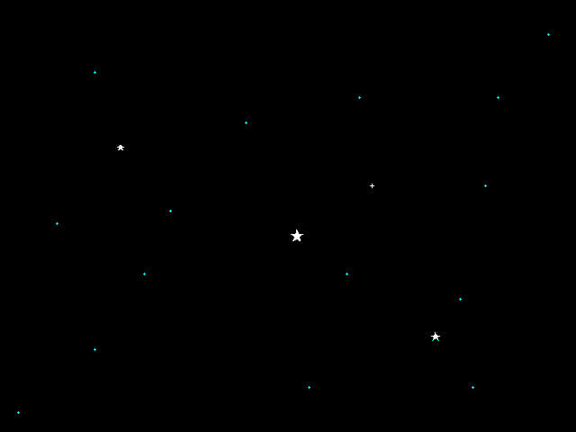

# Commander Starry Night screen saver

> A (MacOS) clone of the old Norton Commander 3 screen saver

This project is a custom macOS screen saver that displays animated stars. The stars are customisable through a `config.json` file, which allows users to set font styles, animation speeds, and more.

<center></center>

## Features

- **Animated Stars**: The stars *"move"* around the screen with a chance to go *"Nova"*.

## Configuration

The screen saver can be configured by modifying the `config.json` file. Here's an example of what you can customize:

```json
{
  "starCount": 150,
  "novaProbability": 40,
  "animationTiming": 250
}
```

## License

This project is licensed under the MIT License. See the [LICENSE.md](LICENSE.md) file for details.

## Change Log

This project maintains a change log.  See the [CHANGELOG.md](CHANGELOG.md) file for a history of milestone changes.

## Acknowledgment

The `v0.1` code was entirely written by ChatGPT, an AI developed by OpenAI, with guidance and project input from me. *(On a 2013 **iMac**, running **MacOS Catalina** 10.15.7 and **Xcode** 12.4.)*

It has been a learning experience and a joy to create!

The `v0.2` code was rewritten, by hand.  The Chatpardy code logic just didn't seem efficient to my way of logic.  It works, so does mine - there is no "winner", just different.

And from there we refine ... see the [CHANGELOG](CHANGELOG.md).


&nbsp;<br>&nbsp;

---

Made with :heart: by **Vino Rodrigues**
