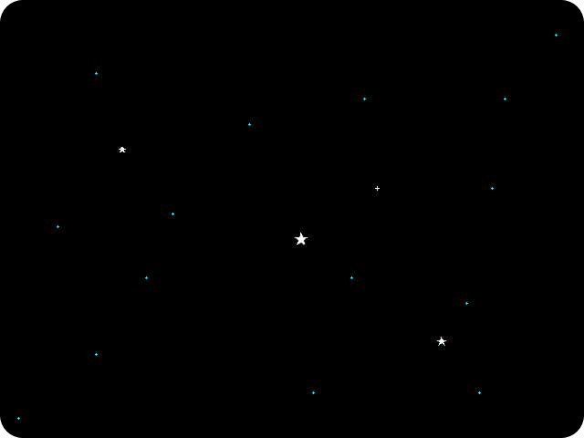

# Commander Starry Night screen saver

> A (MacOS) clone of the old Norton Commander 3 screen saver

This project is a custom macOS screen saver that displays animated stars. The stars are customisable through a `config.json` file, which allows users to set font styles, animation speeds, and more.

## Features

- **Animated Stars**: The stars *"die"* (with a chance to go *"Nova"*), and new ones are *"born"* around the screen.

This screen saver was designed to be as unintuitive as possible.  "Animation" is slow and steady, specifically designed not not be a source of attention, yet subtle enough to indicate that the Mac is alive.

## Configuration

Configuration is done via the System Preferences > Desktop & Screen Saver > Screen Saver pane.

Default settings are calculated at 1% [of screen resolution] stars, and timing so that each star lives for approximately 1 minute.  Probability of "Nova" is 1 in 25.

## Installing

The package is not signed - so if you want it you will need to compile it from source using Xcode.

Once you've compiled it - copy the `StarSaver.saver` file to the `~/Library/Screen\ Savers/` folder.  It should then appear in the System Preferences.

## License

This project is licensed under the MIT License. See the [LICENSE.md](LICENSE.md) file for details.

## Change Log

This project maintains a change log.  See the [CHANGELOG.md](CHANGELOG.md) file for a history of milestone changes.

## Acknowledgment

The `v0.1` code was entirely written by ChatGPT, an AI developed by OpenAI, with guidance and project input from me. *(On a 2013 **iMac**, running **MacOS Catalina** 10.15.7 and **Xcode** 12.4.)*

It had been a learning experience and a joy to create!

The `v0.2` code was rewritten, by hand.  The Chatpardy code logic just didn't seem efficient to my way of logic.  It works, so does mine - there is no "winner", just different.

And from there we refine ... see the [CHANGELOG](CHANGELOG.md).

&nbsp; &nbsp;

---

Made with :heart: by **Vino Rodrigues**
